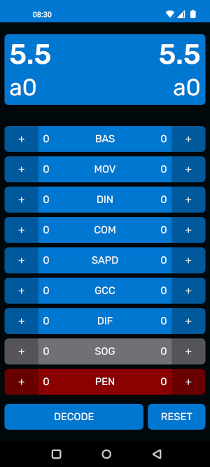

# INCOM Style Codes

Style Codes are a compact method to encode a style judgement in an alphanumeric word that uniquely identifies it. They can be used to quickly record complete style judgements effectively and in a short time, even if done by hand (for example during a tournament), which allows compiling detailed statistics afterwards.

The Style Codes format and the utilities below have been developed by Andrea "AnFive" Ferrario.

## Working with Style Codes

### Servizio Web App

The **Servizio web app** ([servizio.ludosportincom.org](https://servizio.ludosportincom.org))  is the main tool to work with Style Codes. The app is designed to be used by a Style Judge to grade simultaneously the two athletes taking part in a duel. The app also provides a Decode function to convert a Style Code back into the original judgement.

The app can be used with the major browsers (on smartphone and PC) and can also be installed on Android, iOS, and on Windows.

See the [Documentation for the Servizio web app](servizio-webapp.md) for more information.

### Google Sheet Template

There is a template Google Sheet that contains scripted formulas to encode/decode Style Codes. This document can be used as a starting point to create a Google Sheet to process Style Codes, for example a tournament board.
See the [Documentation for the Google Sheet template document](google-sheet-doc.md) for more information.

### Example Implementation

There are example implementations of the Style Codes format in different programming languages available in the repository [https://github.com/anfive/style-codes](https://github.com/anfive/style-codes).

## Style Codes, Explained

See the [Style Codes Documentation](style-codes.md) page for a detailed explanation of the Style Codes format.
