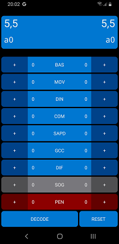
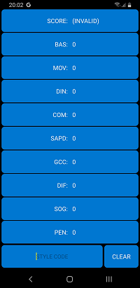

# The Servizio App

The Servizio app for Android is a convenient tool for Style Judges to rate duels. The app computes the style score (and the encoding Style Code) for both athletes on the fly. It also provides a Decode function to decode Style Codes.

**The app has been replaced by the [Servizio web app](servizio-webapp.md) which is now the recommended tool for style judges.**

The app can be found on the Google Play Store here: https://play.google.com/store/apps/details?id=it.gnah.nordic.servizio

The app is **for Android only**. For other systems (but also for Android) it is recommended to use the [Servizio web app](servizio-webapp.md).

### How to use the app

The main interface of the app is represented in the picture below.

The interface can be used to rate both athletes in a duel at the same time. The left part of the interface refers to the first athlete, while the right part refers to the second athlete.

Pressing the buttons marked with a **+** sign adds a point in the corresponding category for the corresponding athlete. The Style score and Style Code is automatically updated when a point is added.

The first 8 categories (all except `PEN`) have a minimum value of 0 and a maximum value of 3. Pressing the corresponding **+** button again when the value is 3 will reset the value to zero.

The `PEN` category has a maximum value of 20, which also wraps back to zero. To reset the `PEN` value to zero quickly, long-press (hold) the corresponding **+** button for a few seconds.

Long-press (hold) the `RESET` button for a few seconds to reset *all* values to zero for both athletes.

Press the `DECODE` button to enter Decode mode.

### Decode mode

Decode mode allows decoding a Style Code into the original judgement (combination of points in the 9 categories). Enter the alphanumeric code in the text field to decode it automatically, if it corresponds to a valid style code.

Press the `CLEAR` button to clear the entered Style Code. Press the *back* button on your device to return to the main interface.

