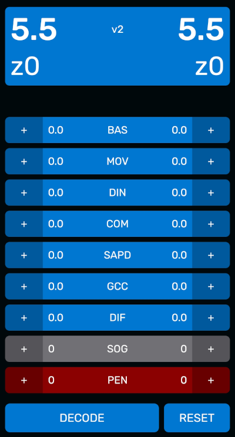
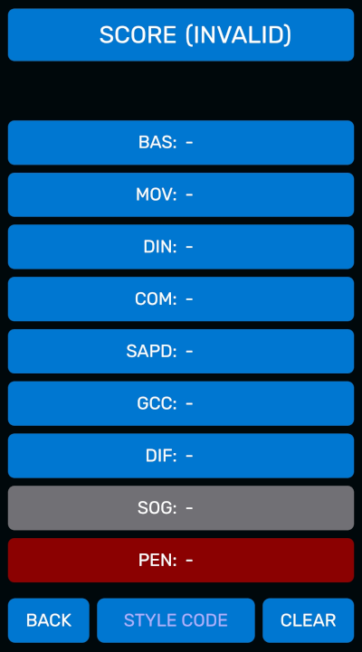

# The Servizio Web App

### Quick Reference

Link: [servizio.ludosportincom.org](https://servizio.ludosportincom.org)

* **Tap** the blue "+" buttons to add half point (0,5). **Long-press** the blue "+" buttons to remove half point (0,5).
* **Tap** the gray button to add one SOG point. **Long-press** the gray button to remove one SOG point.
* **Tap** the red button to add one penalty. **Long-press** the red button to clear (remove all penalties).
* **Long-press** the "RESET" button to reset all values to zero.
* **Tap** each Style Code to copy it to the clipboard.
* **Tap** the "DECODE" button to enter Decode mode.

### Description

The Servizio web app is a convenient tool for Style Judges to rate duels. The app computes the style score (and the encoding Style Code) for both athletes on the fly. It also provides a Decode function to decode Style Codes.

The app can be found at [servizio.ludosportincom.org](https://servizio.ludosportincom.org) and it works with the major browsers. See below for browser support. The app was developed by Alessandro Luppi and Andrea "AnFive" Ferrario.

### Installing the app

The app can be installed on an Android, iPhone, and on Windows from the browser (using the Progressive Web Apps technology). It is recommended to install the app for better usability.

To install the app on your device:

**Android**:

- Open [servizio.ludosportincom.org](https://servizio.ludosportincom.org) using Google Chrome.
- From the menu (three dots at the top right), tap "Add to Home".

The app can be installed similarly using Firefox.

**iPhone**:

- Open [servizio.ludosportincom.org](https://servizio.ludosportincom.org) using Safari.
- Tap "Share".
- Scroll down and tap "Add to Home Screen".

**Windows**

- Open [servizio.ludosportincom.org](https://servizio.ludosportincom.org) using Chrome or Edge.
- Click on the "Install" button that appears at the right of the address bar (it might take a few seconds).

### How to use the app

The main interface of the app is represented in the picture below.

The interface can be used to rate both athletes in a duel at the same time. The left part of the interface refers to the first athlete, while the right part refers to the second athlete.

Pressing the buttons marked with a **+** sign adds half a point (for Technical coefficients, in blue) or a point (for `SOG` and `PEN`) for the corresponding athlete. The Style score and Style Code is automatically updated when a point is added.

The first 8 categories (all except `PEN`) have a minimum value of 0 and a maximum value of 3. Pressing the corresponding **+** button again when the value is 3 will reset the value to zero. **Long-pressing** the **+** button will remove half a point or a point (for Technical coefficients and `SOG` respectively). Long-pressing when the value is zero will set the value to the maximum.

The `PEN` category has a maximum value of 20, which also wraps back to zero. To reset the `PEN` value to zero quickly, long-press (hold) the corresponding **+** button for a few seconds.

Long-press (hold) the `RESET` button for a few seconds to reset *all* values to zero for both athletes.

Press the `DECODE` button to enter Decode mode.

### Decode mode

Decode mode allows decoding a Style Code into the original judgement (combination of points in the 9 categories). Enter the alphanumeric code in the text field to decode it automatically, if it corresponds to a valid style code.

Press the `CLEAR` button to clear the entered Style Code. Press the *back* button on your device or the `BACK` button in the UI to return to the main interface.

### Browser support

The app has been tested with updated versions of the browsers below. It might still work with untested browsers.

Windows:
- Mozilla Firefox
- Google Chrome
- Microsoft Edge

Android
- Mozilla Firefox
- Google Chrome
- Microsoft Edge

iPhone:
- Safari
- Google Chrome

The app has been reported to **not** work correctly with Mi browser.

### Feedback

For feedback, suggestions, or bug reports, please contact INCOM using the contacts on the [INCOM Portal](https://www.ludosportincom.org).